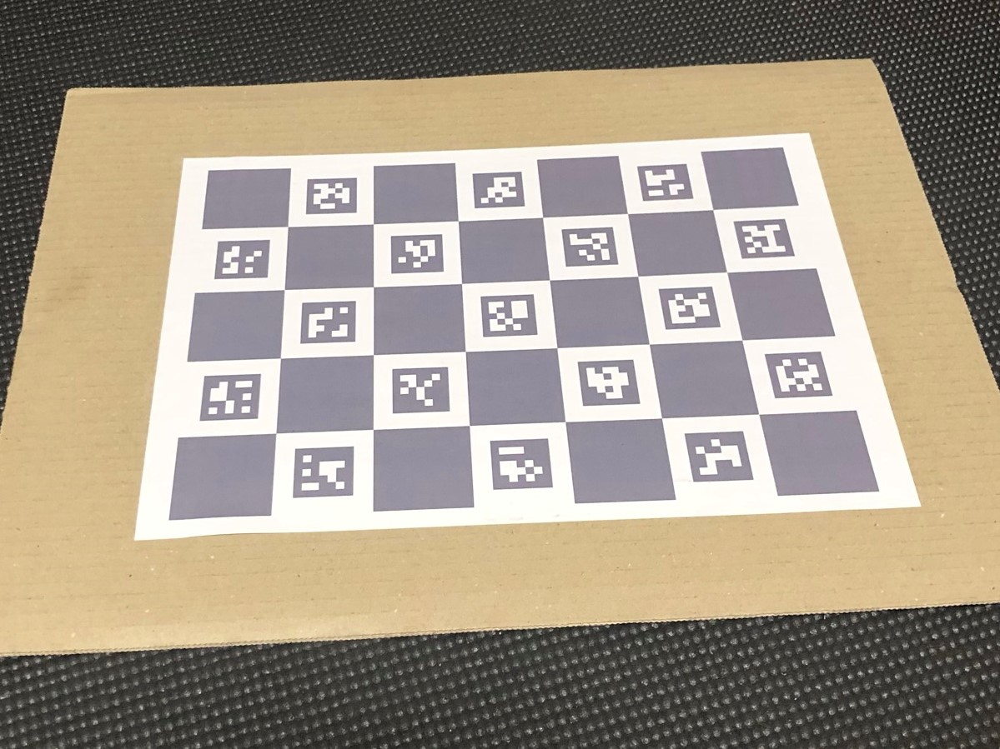
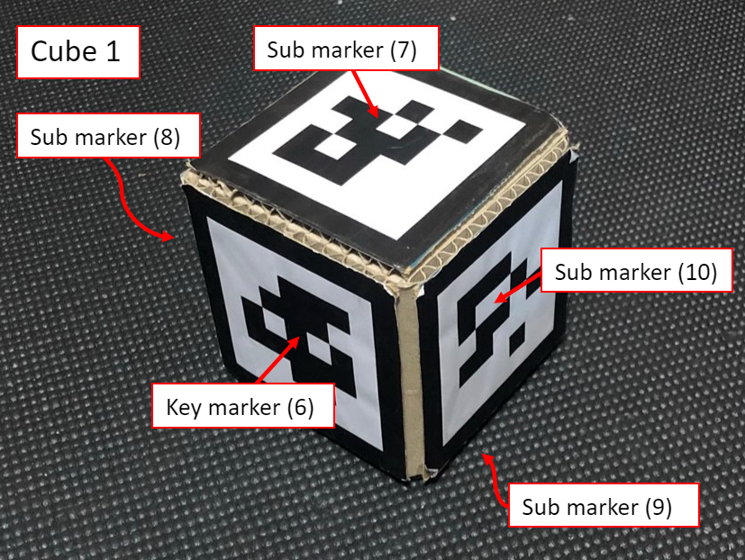
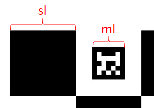
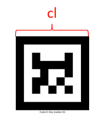

# VCubeTracker Setup

## Crafting

### Calibration Board

Print out `misc\board.png` to a paper. A4 or larger one is recommended. Attach it on a hard board.



### Cubes

1. Print out `misc\markers.pdf` to a paper. A marker length should be about 10 centimeters.

2. Then create three cubes to paste markers. You can use any materials such as cardboards.

3. Finally paste markers to cubes. Sub markers should be located next to a key marker.

We calibrate marker alignments later, so you don't have to worry about cube's accuracy.



## Calibration

There are two part of calibration, camera and markers. Finally you will get `camera.yaml` and `markers.yaml`.

### Camera Calibration

1. Measure your calibration board in millimeters (`sl` and `ml`).

    

2. Execute `calibrate_camera_charuco.exe` with following options.

    ```
    .\calibrate_camera_charuco.exe -d=18 -w=5 -h=7 -sl=<sl in millimeters> -ml=<ml in millimeters> camera.yaml
    ```

3. Take pictures of the calibration board in various position and rotation by pressing **C** key. Please take more than 8 pictures.

4. Finally press **Esc** key.

### Cube Calibration

1. Measure your marker in millimeters (`cl`).

    

2. Execure `calibrate_marker.exe` with following options.

    ```
    .\calibrate_marker.exe --cl=<cl in millimeters> markers.yaml
    ```

3. Take pictures of cubes by pressing **C** key. At this time, only one key marker and one sub marker should be taken in a picture. All combinations are listed below.

    | Cube | Key marker | Sub marker |
    |---|---|---|
    | 0 | 0 | 1 |
    | 0 | 0 | 2 |
    | 0 | 0 | 3 |
    | 0 | 0 | 4 |
    | 1 | 6 | 7 |
    | 1 | 6 | 8 |
    | 1 | 6 | 9 |
    | 1 | 6 | 10 |
    | 2 | 12 | 13 |
    | 2 | 12 | 14 |
    | 2 | 12 | 15 |
    | 2 | 12 | 16 |

4. Once all combinations are taken, you can exit the program by pressing **Esc** key.
